# gyrfalcon-sim

A Falcon-*style* reliable transport built as a discrete-event simulator, with a dashboard that
shows the inside of a transfer: which packet was lost, which timer noticed, what it cost, and
what the congestion controller decided next.

**This is not the Falcon paper's code and does not reproduce its numbers.** It is a teaching
implementation of the same *shape* of design — a mechanism datapath that never chooses a policy,
and a separate engine that sends it events and hands back parameters. Where it simplifies the
paper, `docs/feature-matrix.md` says so and says why.

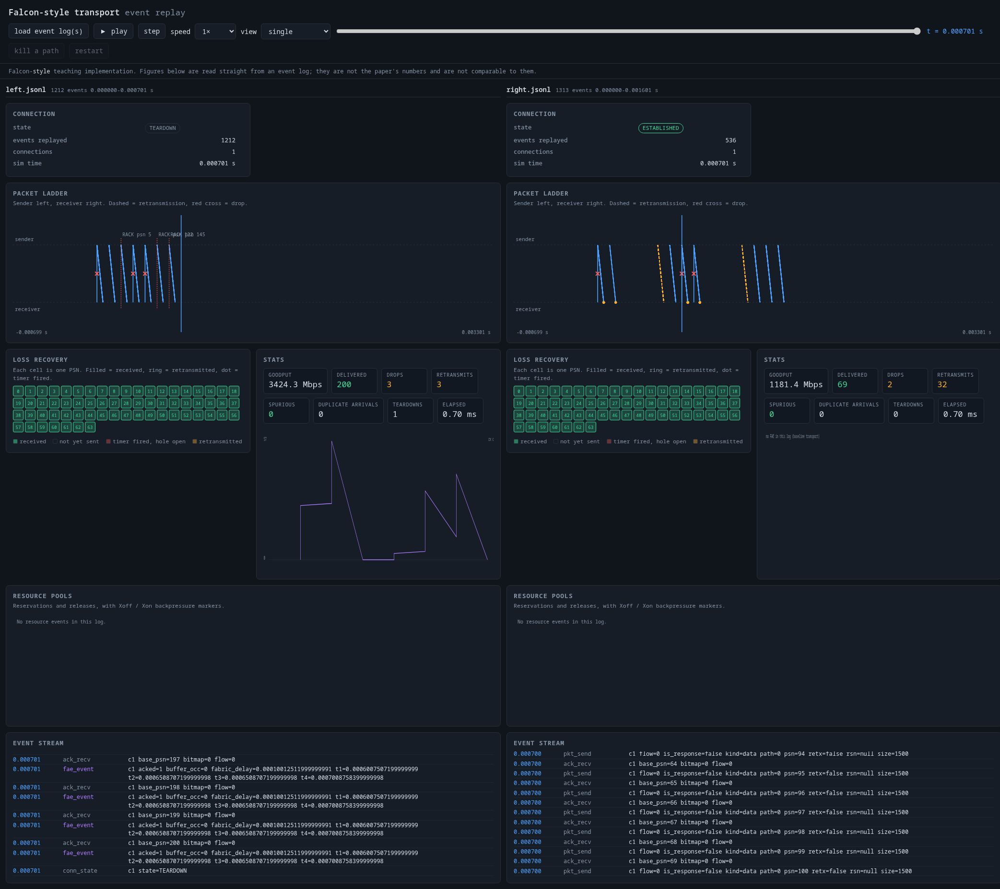

## Quickstart

```bash
# Setup
python -m venv .venv && source .venv/bin/activate
pip install -e ".[dev]"

# Run tests
make test          # 109 tests

# Generate experiment plots
make plots         # saves to results/

# Run all demo scenarios
make demos         # generates logs in results/demo/

# Launch replay dashboard
make dashboard     # open http://localhost:8000/
```

Load any `.jsonl` file from `results/demo/` or `results/` into the dashboard to replay it.

## What this does

This is a discrete-event simulator of a Falcon-style reliable transport. It models an impaired network (delay, loss, reordering, bandwidth, path failures) and compares transports (Go-Back-N, Selective Repeat, Falcon-style). Key features:

- **Pure mechanism vs policy split**: Protocol logic in `pdl/` and `tl/` never hardcodes congestion control, timeouts, or scheduling — all policy decisions come from `fae/` via injected `Policy` objects.
- **Deterministic & replayable**: Same seed produces identical event logs (JSONL). Every measurement comes from replayable logs.
- **Full observability**: Every state change emits a schema-conformant event (`docs/event-schema.md`). The dashboard replays these logs to visualize packet flows, losses, retransmissions, RACK/TLP firing, ACK bitmaps, resource pools, and FAE parameter changes.
- **Multipath + CC swap**: Flows share PSN space with per-flow windows; you can swap congestion controllers (Swift-style vs AIMD) without touching mechanism code.
- **Realistic workloads**: Includes bulk transfer, remote disk (4-16 KB reads, multi-chunk writes with integrity checks), and incast scenarios.
- **Tested & reproducible**: 109 tests validate metrics semantics, event schema, mechanism/policy split, resource carving, and dashboard replay. Demos generate seeded logs for consistent presentations.

## The one idea worth stealing

The datapath cannot make decisions. `pdl/` and `tl/` implement mechanisms — send, buffer,
acknowledge, retransmit, reserve, backpressure — and every value they would normally hardcode
(rack timeout, tlp threshold, cwnd, path assignment, scheduling rule) arrives from a `Policy`
object that only `fae/` ever writes.

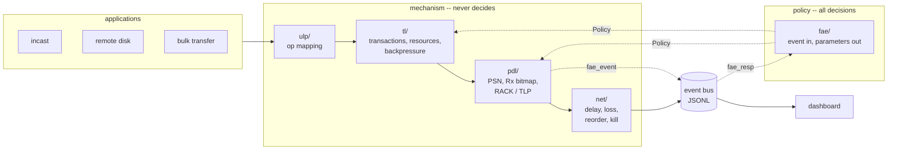

Neither mechanism module assigns a policy constant, names a congestion controller, or writes to
a `Policy`. All three come back empty:

```bash
grep -rnP '^\s*(fcwnd|ncwnd|rack_rto|tlp_idle)\s*=\s*[0-9]' --include='*.py' gyrfalcon/pdl gyrfalcon/tl
grep -rnP 'SwiftCc|AimdCc' --include='*.py' gyrfalcon/pdl gyrfalcon/tl
grep -rnP '[Pp]olicy\w*\.\w+\s*=(?!=)' --include='*.py' gyrfalcon/pdl gyrfalcon/tl
```

`tests/test_fae.py::test_pdl_holds_no_congestion_policy` asserts exactly this, so it stays true.

Swap the congestion controller by naming it at construction. `pdl/` does not change:

```bash
make cc-swap     # or: python experiments/cc_swap.py
```

```
same scenario, same seeds, same pdl/, path slowed 2x at t=0.0002:
  swift  mean fcwnd   8.64   goodput   141.8 Mbps   delivered 235.2/400
  aimd   mean fcwnd   7.32   goodput   459.1 Mbps   delivered 400.0/400
```

AIMD wins that race, and the result is reported rather than tuned around. With a constant
propagation delay and no queueing fabric there is nothing for delay-based control to exploit,
so its gentler back-off costs it throughput. The point being demonstrated is that the swap
changes behaviour at all — on an *unimpaired* path both controllers only ever grow their
window and come out identical, which is why the scenario slows the path.

## What the numbers look like

From `make plots`, over five seeds with 95% confidence intervals. Simulator figures on a
simplified topology; useful for showing a *trend*, not for comparison with anything published.

At 1% loss, 200 packets (`results/loss_sweep.png`):

| transport    | retransmits | goodput   |
| ------------ | ----------- | --------- |
| Go-Back-N    | 64          | 1499 Mbps |
| Falcon-style | 3           | 3424 Mbps |

At 40% reordering (`results/reorder_sweep.png`) — the case the design is actually about:

| transport        | retransmits | spurious | goodput   |
| ---------------- | ----------- | -------- | --------- |
| Go-Back-N        | 1710        | 0        | 58.7 Mbps |
| Selective Repeat | 719         | 153      | 1090 Mbps |
| Falcon-style     | 74          | 0        | 1599 Mbps |

GBN shows zero *spurious* retransmissions only because it retransmits everything on any
reordering, which is worse: its retransmit count is 23× Falcon-style's while delivering the
same bytes. "Spurious" only means something next to how much you retransmit overall.

## Demo scenarios

Each is one command, seeded, and writes a replayable event log to `results/demo/`.

| command         | what it shows                                                               |
| --------------- | --------------------------------------------------------------------------- |
| `make demo-a` | 1% loss, GBN vs Falcon-style, side by side                                  |
| `make demo-b` | 40% reordering; SR's spurious retransmits vs Falcon-style's zero            |
| `make demo-c` | kill a path mid-transfer; the flow reroutes and the transfer still finishes |
| `make demo-d` | 50 senders on one bottleneck; per-sender delivery spread                    |

## How to run & showcase

### Run demos (generate seeded replay logs)

```bash
make demo-a  # 1% loss: GBN vs Falcon-style (side-by-side)
make demo-b  # 40% reordering: spurious retransmissions comparison
make demo-c  # Path kill mid-transfer with flow rerouting
make demo-d  # 50-sender incast with backpressure/fairness
make demos   # All demos at once
```

Logs are saved to `results/demo/*.jsonl`. Each run is deterministic.

### Visualize with the dashboard

```bash
make dashboard  # http://localhost:8000/
```

Load any JSONL log in the UI: packet ladder, ACK bitmap, connection/flow stats, resource pools, and parameter timeline. Use "side by side" to compare two runs with identical seeds.

### Run experiments & generate plots

```bash
make plots  # loss/reorder/incast/remote_disk/multipath/scheduler/cc_swap/host_congestion
ls results/*.png
```

### Swap congestion controllers (mechanism unchanged)

```bash
make cc-swap  # Swift-style vs AIMD on same scenario
```

### Run tests

```bash
make test        # All 109 tests
make test-fast   # Skip slow tests
```

### Live mode (WebSocket)

```bash
make live        # Runs live server on port 8000 (or set LIVE_PORT)
make live-check  # Smoke test of live endpoints
```

### UDP backend (stretch, Linux + tc)

```bash
make netem-demo  # Shows usage for tc netem (requires root)
# See gyrfalcon/udp_demo.py and gyrfalcon/net/udp_path.py for example usage
```

## Results

Every figure is produced by `make plots` and committed next to the code that produced it, so
the tables above and the plots below come from the same logs.

**Goodput vs drop rate** — what loss costs each transport

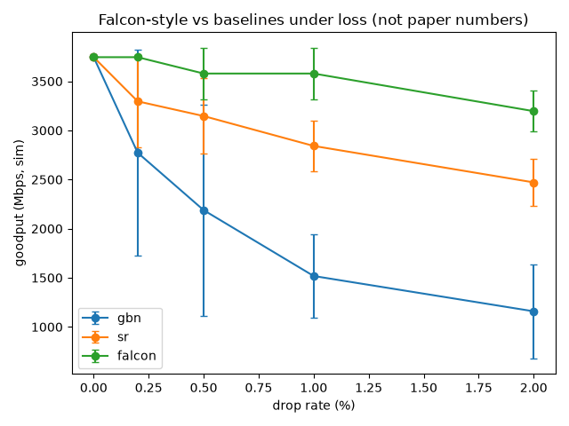

**Goodput vs reordering** — the case the design is actually about

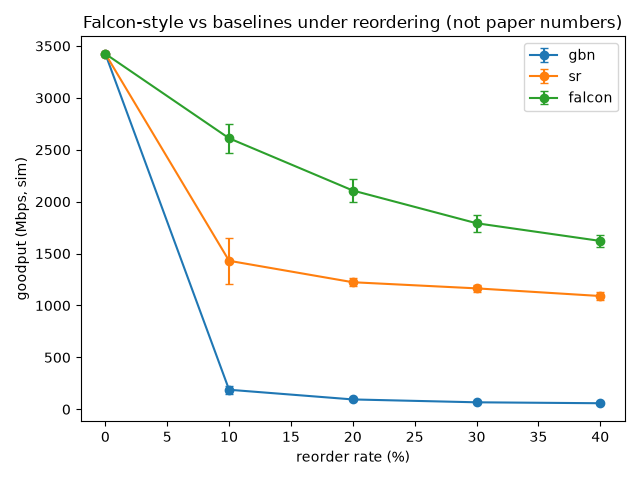

**Wasted (spurious) retransmissions vs reordering**

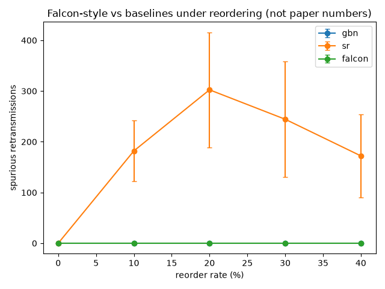

**How unevenly a shared bottleneck is shared** (incast delivery spread)

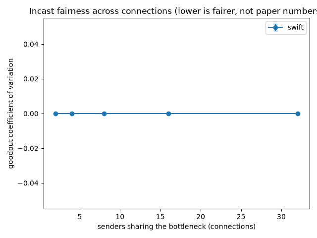

**The worst-served sender in an incast**

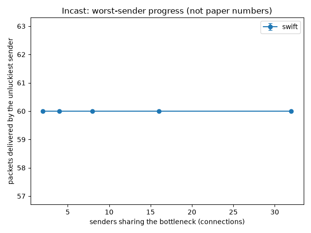

**Whether a lossy path corrupts a block read** (remote disk completion)

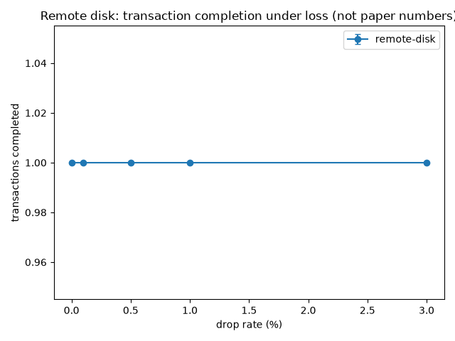

**What a path failure costs** (multipath recovery)

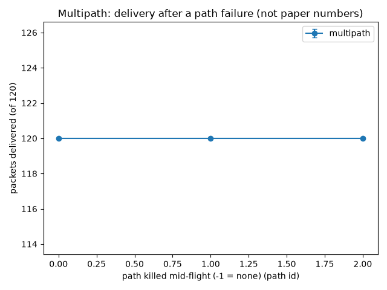

**Largest-open-window vs round-robin scheduling**

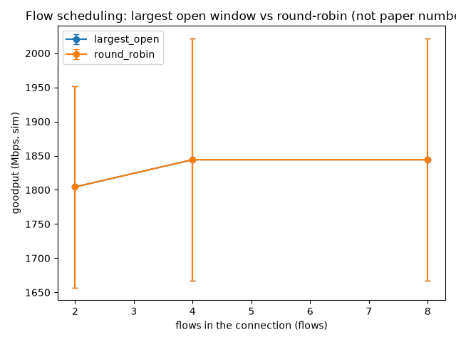

**Swift-style vs AIMD, same `pdl/`** (CC swap window)

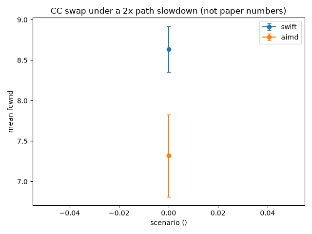

**`ncwnd` falling and recovering as the receiver slows**

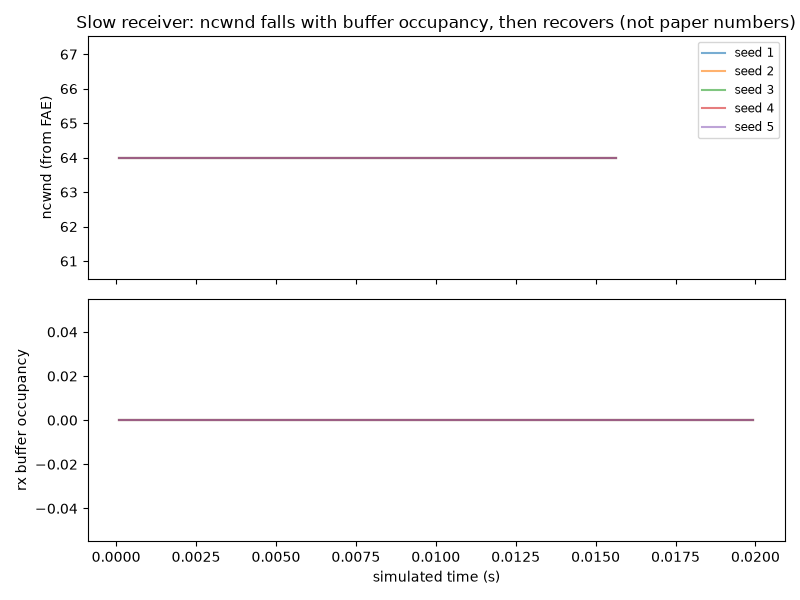

## How this is checked

Every number in this repo is derived from an event log, and every log is replayable. Same seed,
same log, byte for byte.

- `tests/test_metrics.py` — a delivery is an *accepted* arrival, not any arrival; a
  retransmission is spurious only if the PSN was delivered before the retransmission was sent.
- `tests/test_event_schema.py` — validates real logs from all six scenario entry points against
  `docs/event-schema.md`, so an event emitted anywhere the table never mentioned fails loudly.
- `tests/test_fae.py` — asserts `pdl/` never writes to a `Policy` and never names a CC algorithm.
- `tests/test_dashboard.py` — replays every demo log through `dashboard/app.js` in headless
  Chrome and asserts each panel populates. `node --check` only proves the file parses.
- `tests/test_tl.py`, `tests/test_apps.py` — resource pools drain to zero, remote-disk blocks read
  back byte-identical at every loss rate.

`docs/feature-matrix.md` also lists the measurement traps above, because each one produced a
wrong number before it was caught.

## What this is not

- Not Google's Falcon, and not affiliated with it. It implements ideas from the paper, not its code.
- Not hardware. No NICs, DMA, interrupts, queues, or on-chip cache. Paths are independent links
  with no shared queueing fabric, so congestion is modelled by policy, not by a bottleneck forming.
- Not numerically comparable to the paper. Different topology, different constants, simplified CC.
- Not a performance measurement. Goodput figures come from a discrete-event model with an
  artificial clock; they show behaviour and trends, not achievable link rates.
- No handshake from the paper, because the paper does not specify one. `SETUP → ESTABLISHED → TEARDOWN` is our own design and is labelled as such.

## Layout

```
gyrfalcon/
  core/     simulator, event bus, logical clock, RNG   (no protocol knowledge)
  net/      impaired path model: delay, loss, reorder, kill, slow
  pdl/      PSN, Rx bitmap, RACK, TLP                 (mechanism only)
  tl/       transactions, resource pools, backpressure (mechanism only)
  ulp/      RDMA / NVMe op mapping
  fae/      congestion control, timeouts, path choice  (all policy)
  baselines/ Go-Back-N, Selective Repeat
  apps/     incast, remote disk
  harness.py  scenario runners shared by tests and experiments
dashboard/  static HTML/CSS/JS replay app, no build step
experiments/ sweeps; each writes a plot to results/
scripts/    demo log generators and the headless render check
docs/       event schema, feature matrix, plan
```

## Requirements

Python 3.11+. `matplotlib` for plots. Node and a Chrome/Chromium binary are optional and only
used by the dashboard render check, which skips cleanly without them.
