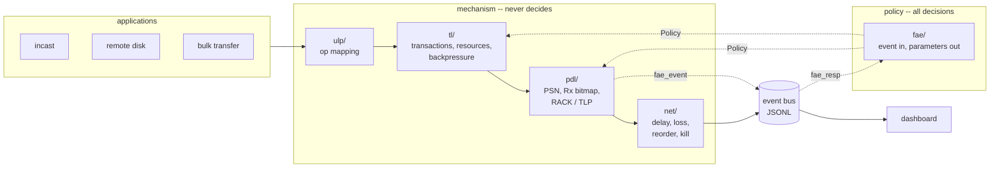

# gyrfalcon-sim

A Falcon-*style* reliable transport built as a discrete-event simulator, with a dashboard that
shows the inside of a transfer: which packet was lost, which timer noticed, what it cost, and
what the congestion controller decided next.

**This is not the Falcon paper's code and does not reproduce its numbers.** It is a teaching
implementation of the same *shape* of design — a mechanism datapath that never chooses a policy,
and a separate engine that sends it events and hands back parameters. Where it simplifies the
paper, `docs/feature-matrix.md` says so and says why.

## Quickstart

```bash
python -m venv .venv && .venv/bin/pip install -e ".[dev]"
make test          # 74 tests
make plots         # experiment plots -> results/
make dashboard     # then open http://localhost:8000/
```

Load any `.jsonl` file from `results/demo/` into the dashboard to replay it.

## The one idea worth stealing

The datapath cannot make decisions. `pdl/` and `tl/` implement mechanisms — send, buffer,
acknowledge, retransmit, reserve, backpressure — and every value they would normally hardcode
(rack timeout, tlp threshold, cwnd, path assignment, scheduling rule) arrives from a `Policy`
object that only `fae/` ever writes.



Neither mechanism module assigns a policy constant, names a congestion controller, or writes to
a `Policy`. All three come back empty:

```bash
grep -rnP '^\s*(fcwnd|ncwnd|rack_rto|tlp_idle)\s*=\s*[0-9]' --include='*.py' falcon/pdl falcon/tl
grep -rnP 'SwiftCc|AimdCc' --include='*.py' falcon/pdl falcon/tl
grep -rnP '[Pp]olicy\w*\.\w+\s*=(?!=)' --include='*.py' falcon/pdl falcon/tl
```

`tests/test_fae.py::test_pdl_holds_no_congestion_policy` asserts exactly this, so it stays true.

Swap the congestion controller by naming it at construction. `pdl/` does not change:

```bash
.venv/bin/python -c "
from falcon.harness import run_bulk_multipath
from falcon.metrics import metrics_from_events
for algo in ('swift', 'aimd'):
    sim = run_bulk_multipath(seed=3, n_packets=300, n_flows=2, algo=algo)
    print(algo, metrics_from_events(sim.bus.events))
"
```

## What the numbers look like

From `make plots`, over five seeds with 95% confidence intervals. Simulator figures on a
simplified topology; useful for showing a *trend*, not for comparison with anything published.

At 1% loss, 200 packets (`results/loss_sweep.png`):

| transport | retransmits | goodput |
|---|---|---|
| Go-Back-N | 64 | 1499 Mbps |
| Falcon-style | 3 | 3424 Mbps |

At 40% reordering (`results/reorder_sweep.png`) — the case the design is actually about:

| transport | retransmits | spurious | goodput |
|---|---|---|---|
| Go-Back-N | 1710 | 0 | 58.7 Mbps |
| Selective Repeat | 719 | 153 | 1090 Mbps |
| Falcon-style | 74 | 0 | 1599 Mbps |

GBN shows zero *spurious* retransmissions only because it retransmits everything on any
reordering, which is worse: its retransmit count is 23× Falcon-style's while delivering the
same bytes. "Spurious" only means something next to how much you retransmit overall.

## Demo scenarios

Each is one command, seeded, and writes a replayable event log to `results/demo/`.

| command | what it shows |
|---|---|
| `make demo-a` | 1% loss, GBN vs Falcon-style, side by side |
| `make demo-b` | 40% reordering; SR's spurious retransmits vs Falcon-style's zero |
| `make demo-c` | kill a path mid-transfer; the flow reroutes and the transfer still finishes |
| `make demo-d` | 50 senders on one bottleneck; per-sender delivery spread |

## Results

| plot | what it answers |
|---|---|
| `loss_sweep.png` | goodput vs drop rate |
| `reorder_sweep.png`, `reorder_spurious.png` | goodput and wasted retransmits vs reordering |
| `incast_fairness.png`, `incast_min_sender.png` | how unevenly a shared bottleneck is shared |
| `remote_disk_completion.png` | whether a lossy path corrupts a block read |
| `multipath_recovery.png` | what a path failure costs |
| `scheduler_policy.png` | largest-open-window vs round-robin |
| `host_congestion.png` | ncwnd falling and recovering as the receiver slows |

## How this is checked

Every number in this repo is derived from an event log, and every log is replayable. Same seed,
same log, byte for byte.

- `tests/test_metrics.py` — a delivery is an *accepted* arrival, not any arrival; a
  retransmission is spurious only if the PSN was delivered before the retransmission was sent.
- `tests/test_event_schema.py` — validates real logs from all six scenario entry points against
  `docs/event-schema.md`, so an event emitted anywhere the table never mentioned fails loudly.
- `tests/test_fae.py` — asserts `pdl/` never writes to a `Policy` and never names a CC algorithm.
- `tests/test_dashboard.py` — replays every demo log through `dashboard/app.js` in headless
  Chrome and asserts each panel populates. `node --check` only proves the file parses.
- `tests/test_tl.py`, `tests/test_apps.py` — resource pools drain to zero, remote-disk blocks read
  back byte-identical at every loss rate.

`docs/feature-matrix.md` also lists the measurement traps above, because each one produced a
wrong number before it was caught.

## What this is not

- Not Google's Falcon, and not affiliated with it. It implements ideas from the paper, not its code.
- Not hardware. No NICs, DMA, interrupts, queues, or on-chip cache. Paths are independent links
  with no shared queueing fabric, so congestion is modelled by policy, not by a bottleneck forming.
- Not numerically comparable to the paper. Different topology, different constants, simplified CC.
- Not a performance measurement. Goodput figures come from a discrete-event model with an
  artificial clock; they show behaviour and trends, not achievable link rates.
- No handshake from the paper, because the paper does not specify one. `SETUP → ESTABLISHED →
  TEARDOWN` is our own design and is labelled as such.

## Layout

```
falcon/
  core/     simulator, event bus, logical clock, RNG   (no protocol knowledge)
  net/      impaired path model: delay, loss, reorder, kill, slow
  pdl/      PSN, Rx bitmap, RACK, TLP                 (mechanism only)
  tl/       transactions, resource pools, backpressure (mechanism only)
  ulp/      RDMA / NVMe op mapping
  fae/      congestion control, timeouts, path choice  (all policy)
  baselines/ Go-Back-N, Selective Repeat
  apps/     incast, remote disk
  harness.py  scenario runners shared by tests and experiments
dashboard/  static HTML/CSS/JS replay app, no build step
experiments/ sweeps; each writes a plot to results/
scripts/    demo log generators and the headless render check
docs/       event schema, feature matrix, plan
```

## Requirements

Python 3.11+. `matplotlib` for plots. Node and a Chrome/Chromium binary are optional and only
used by the dashboard render check, which skips cleanly without them.
